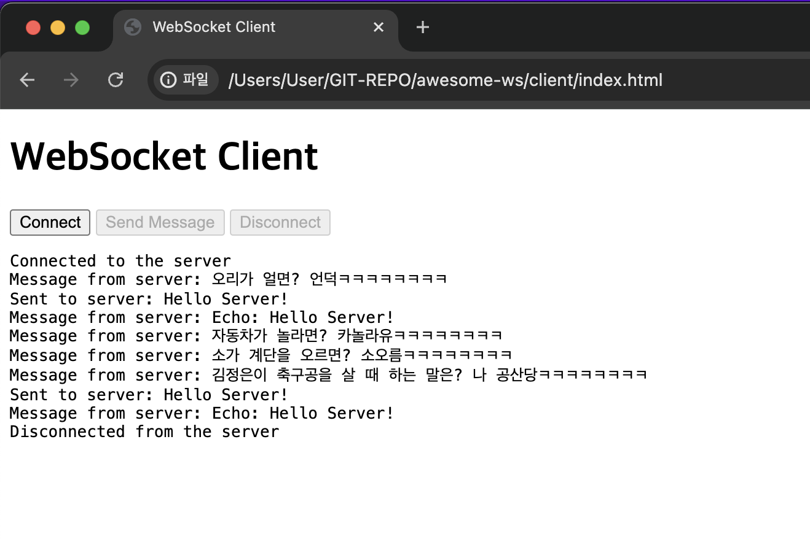

# awesome-ws

Joke generator with WebSocket

# client

## templates



## how to run

- Open `client/index.html` in your browser

# server

## how to run

1. Navigate to the server directory.

```bash
cd server
```

2. Install the required packages.

```bash
npm install
```

3. Start the server.

```bash
npm run start
```

# Project Description

awesome-ws is a joke generator that uses WebSocket for real-time communication between the client and server. The client runs in the browser, while the server is built with Node.js. You can send and receive jokes through the WebSocket connection.

## Tech Stack

- Client: HTML, CSS, JavaScript
- Server: Node.js, WebSocket

## How to Contribute

1. Fork this repository.
2. Create a new branch. (git checkout -b feature-branch)
3. Add your feature or fix a bug.
4. Commit your changes. (git commit -m 'Add new feature')
5. Push your branch. (git push origin feature-branch)
6. Create a pull request.

## License

This project is licensed under the MIT License. See the LICENSE file for details.
